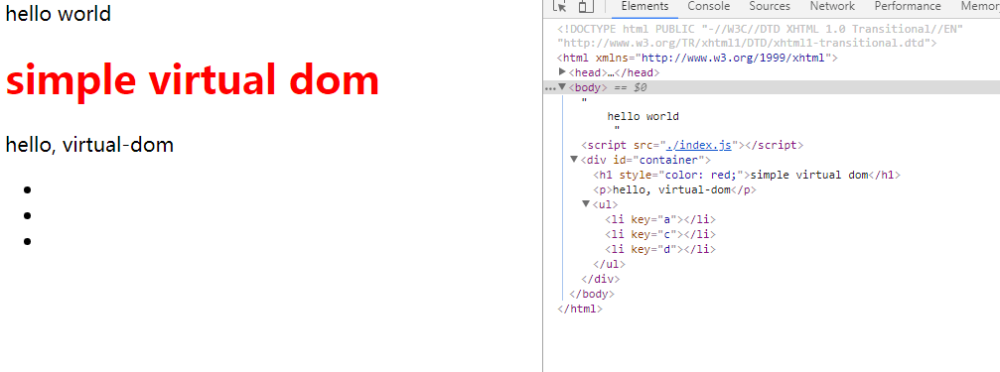

## virtual-dom
#### 本文是学习livoras的simple-virtual-dom的源码，觉得人家的东西只有自己敲一遍加以理解才能慢慢掌握其中的脊髓，其中的一些注释，仅仅是个人对代码的理解，如果其中有什么错误，希望批评指正，谢谢！
### 参考文章：
1. [livoras/simple-virtual-dom ](https://github.com/livoras/simple-virtual-dom) 
2. [如何理解虚拟DOM](https://www.zhihu.com/question/29504639?sort=created)
3. [livoras/list-diff](https://github.com/livoras/list-diff)

### Usage
验证为了麻烦，本次直接将所有代码，全部复制到了index.js文件中，通过index.html引入index，验证结果。

test：
```
var tree=new Element("div",{id:"container"},[
    new Element( "h1",{style: 'color: blue'},["simple virtual dom"]),
    new Element( "p",["hello, virtual-dom"]),
    new Element( "ul",[
      new Element("li",{key:"a"}),
      new Element("li",{key:"b"}),
      new Element("li",{key:"c"})
  ])

   
]);

var root=tree.render();
document.getElementsByTagName("body")[0].appendChild(root);
var newTree =new Element('div', {'id': 'container'}, [
    new Element('h1', {style: 'color: red'}, ['simple virtal dom']),
    new Element('p', ['Hello, virtual-dom']),
    new Element('ul', [
      new Element('li',{key:"a"}), 
      new Element('li',{key:"c"}),
      new Element('li',{key:"d"}),
  ])
])

var patches=diff(tree,newTree);
//
console.log(patches,'patches---------');
console.log(tree,newTree,'tree--------newtree----------');
patch(root,patches);
```
得到的结果如图：


### summer

1. 本次源码勾起了，我对二叉树对于广度遍历和深度遍历的实现方法，产生好奇，后续努力自己实现一遍
2. 对于patch.js中的一行代码，还有所疑问，自己没有验证出来，如果有幸被朋友们看到，帮助我对它的理解，本人不胜感激。
```
//为了避免动态的节点已经被删除了,childNodes 是动态的, 添加删除节点会发生改变
            if(staticNodeList[index]===node.childNodes[index]){

                node.removeChild(node.childNodes[index]);
            }
            staticNodeList.splice(index,1);
```